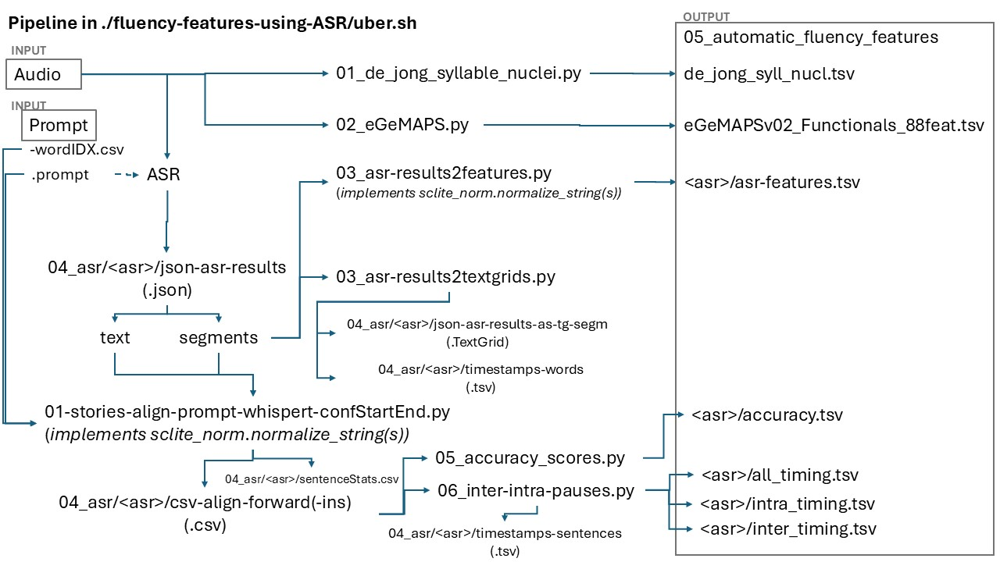

# fluency-features-ASR-IS2025
This repository contains a pipeline to automatically calculate features related to oral reading fluency from speech.

## Setup

1. Navigate in your terminal to the repository.

    `cd fluency-features-ASR-IS2025`

2. To install the repository as a local package, run:

    `pip install -e .`

3. To install the required packages:
    
    `pip install requirements.txt`

## Step 1: Prepare your data

Create a folder $datasetDir to which you add the following four folders with input data:
| Folder | Description|
|---|---|
| 00_orig_data/audio          | original .wav files of children reading stories | 
| 00_orig_data/textgrids     | .TextGrid files with orthographic transcriptions. | 
| 01_prompts                 |  <promptID>.prompt files with the story the child had to read and <promptID>-wordIDX.csv files with the prompt words annotated with prompt_id (structure: <sentence_nr>_<word_nr>_<prompt>) | 
| 02_audio                    | preprocessed .wav files, one .wav file for each read story, naming convention: <speakerID>-<promptID>.wav | 
| 03_metadata                 | contains one file, recordingsDF.tsv, which links all information (i.e., original audio file name, preprocessed audio file name, promptID, speakerID, etc.) | 

Example of input data in tree structure:
```
    .
    ├── 00_orig_data
    │   ├── audio
    │   │   └── fn000049.wav
    │   └── textgrids
    │       └── AVI 6
    │           └── fn000049_updated.TextGrid
    ├── 01_prompts
    │   ├── AVI6_story1.prompt
    │   ├── AVI6_story2.prompt
    │   ├── AVI6_story1-wordIDX.csv
    │   └── AVI6_story2-wordIDX.csv
    ├── 02_audio
    │   ├── N000025-AVI6_story1.wav
    │   └── N000025-AVI6_story2.wav
    └── 03_metadata
        └── recordingsDF.tsv
    
```

## Step 2: Run uber.sh

Open `uber.sh` and set the input variable 'datasetDir' to the folder $datasetDir that you created in step 1.

Run ./uber.sh and the following steps are performed:
- The audio recordings in 02_audio are automatically transcribed using whisper-timestamped (model: asr-decoders/whispert.py; output: 04_audio/<asrSystem>/json_asr_results).
- These ASR transcripts are automatically aligned with the prompts see: 04_audio/<asrSystem>/csv-align-forward and 04_audio/<asrSystem>/csv-align-forward-ins (contains by the speaker inserted words and phrases).
- Automatic fluency features are computed from these ASR results and the alignments with the prompt and saved in the folder `$datasetDir/05_automatic_fluency_features`.
- Human fluency features are computed form the manual/human orthographic transcriptions (00_orig_data/textgrids) and saved in the folder `$datasetDir/06_manual_fluency_features`



# Citation
If you use this repository, please use the following reference:

    Harmsen, W., van Hout, R., Cucchiarini, C. and Strik, H. (2025). Can ASR generate valid measures of child reading fluency? 
